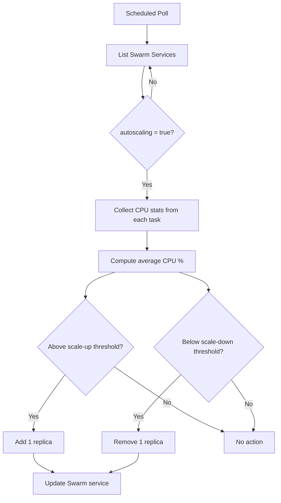

# Local Orchestrator

A lightweight auto-scaler for Docker Swarm services. Monitors CPU usage across cluster nodes and scales services up or down based on configurable thresholds.

## How It Works

The orchestrator periodically:

1. Lists all Swarm services with `autoscaling=true` label
2. Collects CPU stats from each running task via the Docker API on each node
3. Computes average CPU and applies the scaling policy (scale up/down by 1 replica)

## Architecture



## Service Labels

Add these labels to any Swarm service to enable auto-scaling:

| Label | Default | Description |
|-------|---------|-------------|
| `autoscaling` | — | Set to `true` to enable |
| `min-replicas` | `1` | Minimum replica count |
| `max-replicas` | `5` | Maximum replica count |
| `scale-up-cpu` | `70` | CPU % threshold to add a replica |
| `scale-down-cpu` | `30` | CPU % threshold to remove a replica |

## Environment Variables

| Variable | Default | Description |
|----------|---------|-------------|
| `MANAGER_HOST` | `tcp://localhost:2375` | Docker Swarm manager endpoint |
| `DOCKER_API_PORT` | `2375` | Port used to reach the Docker API on worker nodes |
| `FREQUENCY` | `60000` | Polling interval in milliseconds |

## Stack Example

```yaml
services:
  orquestrator:
    image: dbohry/local-orquestrator:latest
    network_mode: "host"
    environment:
      - MANAGER_HOST=tcp://swarm-manager:2375
    deploy:
      update_config:
        order: start-first
      placement:
        constraints: [node.role == manager]
```

## Build & Run

```bash
# Build
./gradlew jar

# Run locally
./gradlew runOrch

# Docker
docker build -t local-orquestrator .
docker run -e MANAGER_HOST=tcp://swarm-manager:2375 local-orquestrator
```

## Requirements

- Java 25+
- Docker Swarm cluster with API exposed on worker nodes